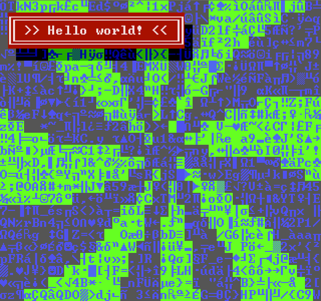

# Processing TextMode

A [TextMode](http://en.wikipedia.org/wiki/Text_mode) library for Processing, ported from the work done by [Paul Greenfell](https://twitter.com/evilpaul_atebit) (aka evilpaul).



## Documentation

See [evilpaul's TextMode Canvas Library](http://evilpaul.org/wp/?p=504) post for more information. I tried to stay true to his original method naming and arguments.

## Events

Processing doesn't support anonymous functions so there had to be a slight alteration to the original library, specifically the **processBox** method. As a result there are two ways to implement this method:

From any object, including your sketch's main file:

    ```java
    // this could be your draw method
    void somewhere() {
      textModeInstance.processBox(x,y,w,h,this,"functionToCall")
    }

    // must follow this format
    int[] functionToCall(int charId,int colorId) {
      int[] foo = { charId, colorId };
      // do something to foo
      return foo;
    }

You could also process a box in a class by implementing the TextModeCallback delegate.

    ```java
    class MyClass implements TextModeCallback {

      void somewhere() {
        myTextMode.processBox(x,y,w,h,"an arbitrary string!",this);
      }

      int[] textModeProcessBoxHandler(String id,int charId,int colorId) {
        int[] foo = { charId, colorId };

        if(id == "an arbitrary string!") {
          // do something to foo
       }

        return foo;
      }
    }

## Installation Instructions

1. Copy TextModeScreen.pde and font.png into your sketch.
2. Follow the example files for additional help.